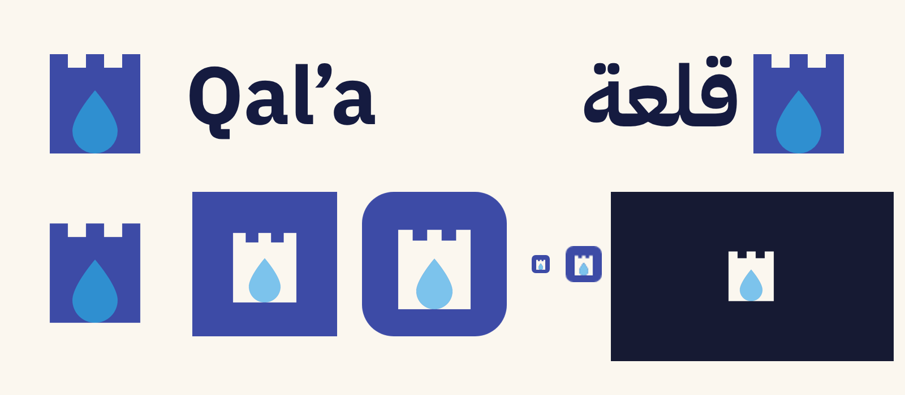

# Qal'a (قلعة)

An original turn-based strategy board game rooted in Arab heritage, with a learning path and an AI coach. In **Wells & Walls**, two desert fortresses fight over two wells, and an army can only attack while it is linked to water.

## Documents

| Document | What it is |
|---|---|
| [docs/concepts.md](docs/concepts.md) | Step 1: three game concepts and the choice |
| [docs/rules.md](docs/rules.md) | The official rules (**v0.6**) |
| [docs/balance-log.md](docs/balance-log.md) | Every rules version tested by AI self-play, with results |
| [docs/playtest-guide.md](docs/playtest-guide.md) | How to run playtests with real people |
| [docs/GDD.md](docs/GDD.md) | Game design: learning path, AI levels, progression, online play, MVP scope |
| [docs/brand-kit.md](docs/brand-kit.md) | Logo, colour, type, motion, voice |
| [docs/architecture.md](docs/architecture.md) | Services, API and event contract, ports |

## Monorepo

| Path | Stack | What it is |
|---|---|---|
| `packages/game_core` | Dart | The rules engine (reference implementation) and the cross-language test vectors |
| `packages/game_ai` | Dart | AI players (alpha-beta search) |
| `tools/balance` | Dart | Balance lab: AI self-play reports |
| `prototype/` | Flutter + Flame | Throwaway playtest prototype |
| `brand/` | JSON → CSS/SCSS/TS/Dart | Brand tokens (single source), logo, icons |
| `mobile/` | Flutter (clean architecture, BLoC, Flame) | The game app |
| `backend/` | .NET 9 modular | Auth, players and ratings, online matches (server-validated rules) |
| `ai-service/` | Python FastAPI + Azure OpenAI | AI coach: rules Q&A (RAG) and post-game review |
| `frontend/` | Angular 20 + Nx 21 | Admin console: live balance dashboard, players, matches |

Each folder has its own README with run and test commands, and its own CI workflow in `.github/workflows/`.
