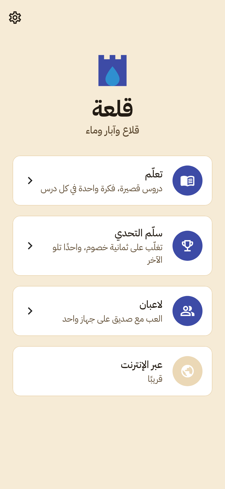
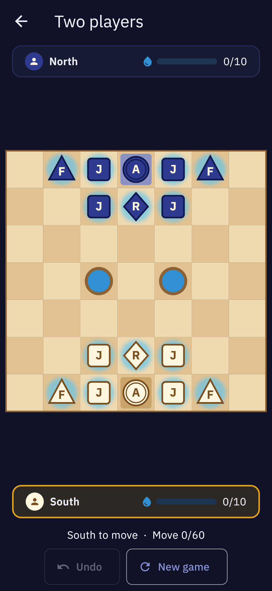
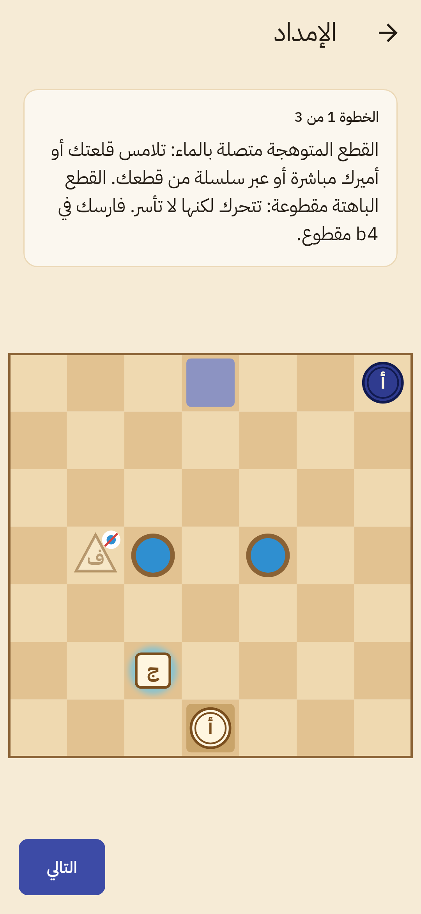

# Qal'a mobile app (قلعة)

The production Flutter app, built with feature-first clean architecture (`flutter-clean-mobile`). This milestone is **M1, the offline MVP** (docs/GDD.md §11): learning path, AI ladder, and two-player games on one device, all fully offline, in Arabic and English.

| Arabic home (light) | Two players (dark) | Lesson (Arabic) |
|---|---|---|
|  |  |  |

## Run

```sh
fvm use                       # Flutter version pinned in .fvmrc (3.47.7)
flutter pub get
flutter run --flavor dev -t lib/main_dev.dart --dart-define-from-file=dart_defines/dev.json
```

| Flavor | Entry | Android id | Notes |
|---|---|---|---|
| dev | `lib/main_dev.dart` | `com.qala.app.dev` | cleartext allowed to `10.0.2.2` (local backend) |
| staging / uat | `lib/main_staging.dart` / `main_uat.dart` | `.staging` / `.uat` | |
| prod | `lib/main_prod.dart` | `com.qala.app` | |

`dart_defines/*.json` holds public values only (URLs, client id, feature flags). Never put secrets there.

## Structure

```
lib/
├── main_{dev,staging,uat,prod}.dart → bootstrap(Flavor)
├── app/      di (get_it) · env · router (go_router) · theme (Material 3 + AppTokens from the brand kit)
├── core/     error (sealed Failure) · network (DioFactory, AuthInterceptor, LanguageInterceptor, ErrorMapper)
│             storage (KeyValueStore, Sembast) · l10n · domain (LocalizedText) · widgets/board (Flame board)
└── features/
    ├── game/      play: pass-and-play and against the AI (GameBloc; AI search in an isolate)
    ├── ladder/    eight-opponent ladder progress (levels 1–6 in the MVP)
    ├── learn/     lessons from assets/lessons/lessons.json (LessonBloc: show → try → check, stars)
    ├── settings/  language, theme, coach tips (SettingsCubit; no restart on language change)
    ├── home/      mode hub
    └── splash/    animated logo
```

Each feature has `domain` (entities, repository interfaces, use cases) → `data` (data sources, repository implementations) → `presentation` (blocs, pages, widgets), plus a `{feature}_injection.dart`.

**One deliberate exception to the dependency rule:** `domain` imports `package:game_core` (and `data` imports `game_ai`). The rules engine is pure Dart with no Flutter, and *is* the game's domain model, shared with the balance lab and verified against the C# server port.

## Brand

`brand/tokens.json` is the single source of truth (docs/brand-kit.md). After changing it:

```sh
python3 ../brand/tools/build_tokens.py     # regenerate tokens and check contrast
dart run tool/sync_brand.dart              # copy tokens, icons and logo into the app
dart run flutter_launcher_icons            # app icons (adaptive + monochrome)
dart run flutter_native_splash:create      # native splash (light + dark)
```

The fonts are IBM Plex Sans Arabic and IBM Plex Sans (OFL), bundled in `assets/fonts`.

## Lessons

Lessons are data in `assets/lessons/lessons.json`: chapters → lessons → steps (bilingual text, a position in game_core notation, the accepted moves). `test/features/learn/lessons_data_test.dart` checks that every expected move is legal, and that the supply and cut-the-line lessons really do what their text says. The lesson text is written by people, never generated.

## Tests

```sh
flutter analyze                        # very_good_analysis, zero issues
flutter test --exclude-tags golden     # unit + bloc + widget tests
flutter test --tags golden             # golden screenshots (host-dependent)
```

## Not done yet (by milestone)

| Item | Milestone | Notes |
|---|---|---|
| Firebase (Crashlytics, Analytics, Remote Config, FCM) | M1 release | Needs the Firebase projects and `google-services.json` / `GoogleService-Info.plist` per flavor; `bootstrap.dart` marks the steps |
| iOS schemes per flavor | M1 release | Android flavors are configured; iOS needs Xcode schemes and configs |
| Chapters 4–7, the puzzle miner, the daily puzzle | M1 → launch | Content (GDD §4) |
| Ladder levels 7–8 | launch | Needs iterative deepening and a transposition table in `game_ai` |
| Online play (auth, matchmaking, SignalR) | M2 | Retrofit clients per `docs/architecture.md` §5; `AuthInterceptor` and `ErrorMapper` are ready and tested |
| Coach review / chat | M3 | Through `ai-service` (`FEATURE_COACH` flag) |

The Android build could not be run in the authoring environment (no Android SDK). The analyzer and all tests pass; build the APK locally with `flutter build apk --flavor dev -t lib/main_dev.dart --dart-define-from-file=dart_defines/dev.json`.
