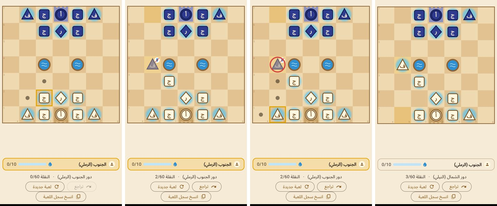
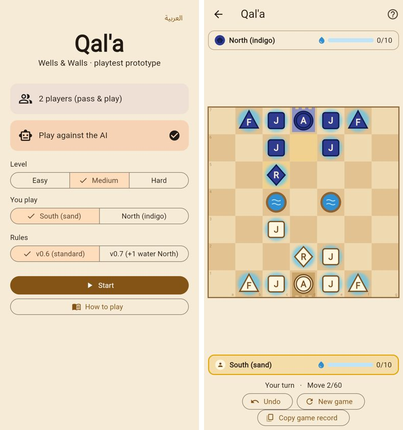

# Qal'a playtest prototype

A quick, playable prototype of **Qal'a: Wells & Walls** (rules v0.6), made for testing with real people. It uses Flutter with Flame and simple shapes: no art and no sound.

It uses the same rules engine (`packages/game_core`) and AI (`packages/game_ai`) as the balance lab, so what players experience is exactly what was balanced.

## Features

- **Pass-and-play** for 2 players on one device.
- **Play against the AI**: Easy, Medium or Hard; play as South or North (the board flips so your side is at the bottom).
- **Arabic and English**, switched on the home screen (Arabic by default).
- **Rules v0.6** (standard) or **v0.7** (+1 water for North), for the first-player-balance question in the playtest guide.
- **Readable supply:** supplied pieces glow blue; cut-off pieces are faded and carry a crossed-out drop. Trying to capture with a cut-off piece shows a "no water" message, which is counted in the record.
- **Water bars** for both players, a move counter (x/60), and highlights for the last move and the legal targets (dot = move, red ring = capture, crosshair = Rami shot).
- **Undo** and **New game**.
- **Copy game record:** a text summary for the playtest log, with the result, end reason, time per move, first move, Rami use, illegal capture attempts, a CSV row and the full move list (see `docs/playtest-guide.md`).

## Run

```sh
cd prototype
flutter pub get
flutter run                 # on a connected phone or emulator
flutter run -d chrome       # in a browser
flutter test
```

## Share with playtesters

The easiest way is the **web build**: any phone can open it from a link.

```sh
flutter build web --release --no-web-resources-cdn
# The site is in build/web/. Host it on any static host, e.g.:
#   Firebase Hosting:  firebase deploy --only hosting
#   Netlify:           netlify deploy --dir=build/web --prod
#   GitHub Pages:      push build/web to a gh-pages branch
```

`--no-web-resources-cdn` bundles the renderer (CanvasKit) with the site, so it works even where Google's CDN is blocked or slow.

The CI workflow (`.github/workflows/prototype.yml`) also builds the web version on every push and attaches it to the run as a downloadable artifact named `prototype-web`.

For an installable Android build: `flutter build apk --release` (needs the Android SDK). For iOS: open `ios/Runner.xcworkspace` in Xcode and distribute through TestFlight.

## Code map

| File | What it does |
|---|---|
| `lib/src/match_controller.dart` | Match state: selection, moves, AI turns (in a background isolate on mobile), undo, timing, hints |
| `lib/src/game_record.dart` | The playtest record (text + CSV) |
| `lib/src/board/board_game.dart` | The Flame game: draws the board and pieces, handles taps, animates the last move |
| `lib/src/board/palette.dart` | Prototype colours |
| `lib/src/screens/` | Home, game and how-to-play screens |
| `lib/src/strings.dart` | All Arabic/English text, and the AI levels |

This is a throwaway prototype for learning, not the production app. The production mobile app (step 5) will follow the clean architecture and brand kit.

## Screenshots

Arabic, pass-and-play: selecting a Jundi, a cut-off North Faris (faded, with the "no water" mark), a capture target, and the capture.



English, against the AI (Medium): the home screen, and the board after the AI's reply.


